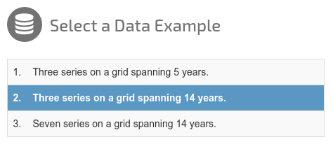
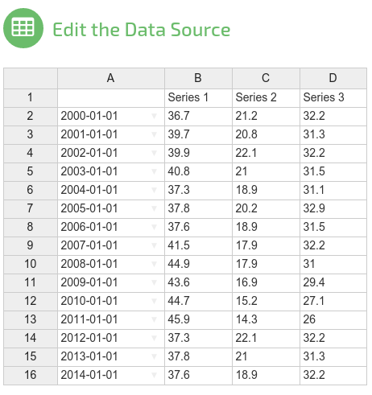
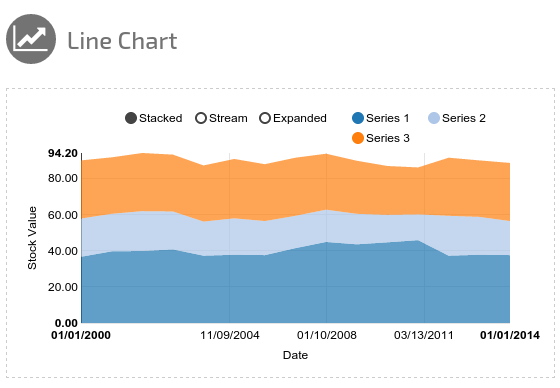
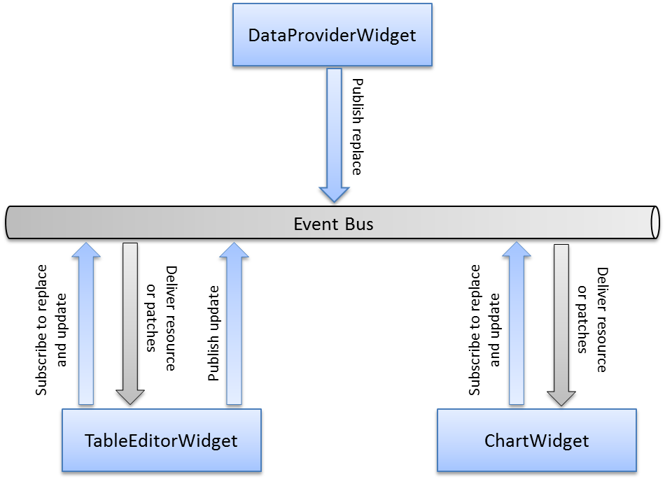

# Mashup Demo Tutorial #

This tutorial shows how widgets communicate between one another by means of the event bus, one of the core concepts of *[LaxarJS](http://laxarjs.org)*.
Event bus communication ensures that widgets are completely separated from each other.
This degree of separation helps you to integrate different external libraries into your application without having conflicts between them.
We demonstrate this concept by integrating two external libraries into different widgets and letting these widgets communicate by a publish/subscribe mechanism.
The mentioned external libraries are:
* a data grid editor: *[Handsontable](http://handsontable.com/)* and
* a chart library: *[Angular-nvD3](http://krispo.github.io/angular-nvd3)*.

Before reading this document, it's recommended to take a look at the [LaxarJS concepts](https://github.com/LaxarJS/laxar/blob/master/docs/concepts.md).
A basic familiarity with *[AngularJS](http://angularjs.org)* and the related web technologies is required as well.
Not strictly necessary, but useful are these additional documents:

* [Why LaxarJS?](https://github.com/LaxarJS/laxar/blob/master/docs/why_laxar.md)
* [Widgets and Activities](https://github.com/LaxarJS/laxar/blob/master/docs/manuals/widgets_and_activities.md)
* [Writing Pages](https://github.com/LaxarJS/laxar/blob/master/docs/manuals/writing_pages.md)
* [Events and Publish-Subscribe](https://github.com/LaxarJS/laxar/blob/master/docs/manuals/events.md)

It's a good idea to explore the ShopDemo as well, as it introduces you to the core concepts of LaxarJS:

* [The ShopDemo](https://github.com/LaxarJS/shop_demo)


## The Widgets ##

The demo makes use of four widgets:
* the HeadlineWidget,
* the DataProviderWidget,
* the TableEditorWidget and
* the ChartWidget.

Each of these widgets will be introduced below. Note that each of these widgets can be instantiated multiple
times on each page as is the case with the ChartWidget.


### HeadlineWidget ##

The HeadlineWidget displays a simple headline and an optional teaser.
In our application we use it to complete the layout with the title "MashupDemo" in the upper right corner.


### DataProviderWidget ##

The DataProviderWidget's task is to provide initial data sets to choose from.
Here data sets consist of a set of time series to be edited and visualized by other widgets.
In a real application this data would be supplied by an *activity* that reads times series resources from a REST service.
We decided to use a widget for demonstration purposes:



When the user selects a data set, the corresponding time series resource is published on the event bus.
For further details on the publish/subscribe mechanism, see [Widget Communication](#widget-communication).


### TableEditorWidget ###

The TableEditorWidget enables the user to modify the initial time series provided by the DataProviderWidget.
For this purpose we decided to use a data grid editor based on the *Handsontable* library:



Time series are shown vertically, i.e. each column corresponds to a time series.
The column headers denote the title of the corresponding time series.
The row headers specify the date which the values are referring to.
All time series must lie on the same date grid.
Missing values are interpreted as `null`.
However the interpretation of `null` values may vary in other widgets.
A chart widget may choose to set `null` values to 0 or ignore them, depending on the chart type or other options.

When a cell value is changed, a corresponding update is published on the event bus.
The accompanying data can be used to reconstruct the modified time series resource.
For further details on the publish/subscribe mechanism, see [Widget Communication](#widget-communication).


### ChartWidget ###

The ChartWidget displays the published time series resource in a chart.
For this purpose we decided to use the chart library *Angular-nvD3*.
It supports different chart types and various options to customize the visual representation.
Our demo has three ChartWidgets each displaying a different chart type: a pie chart, a stacked line chart and a bar chart.
A stacked line chart looks like this:



It's always the current state of the time series resource that is displayed.
In order to do this the ChartWidget subscribes to changes to the time series resource.


## Widget Communication ##

Each widget is a self-contained component that communicates with other widgets through the event bus.
The event bus is one of the central concepts of *LaxarJS*. Widgets are not supposed to transfer data
to each other directly. They are expected to transfer data by certain events via the event bus.
Events and the publish/subscribe mechanism are explained in detail [here](https://github.com/LaxarJS/laxar/blob/master/docs/manuals/events.md).

In our tutorial there is only one resource that gets transferred: the time series data. The resource name is
configured separately for each widget instance. Here we use the resource name `timeSeriesData`, see [mashup_demo.json](../application/pages/mashup_demo.json).
For the DataProviderWidget the resource name is configured by the feature `data`. For the TableEditorWidget
and the instances of the ChartWidget the resource name is configured by the feature `timeSeries`. It goes
without saying that the names must match exactly. Otherwise the subscribing widgets would subscribe to
a resource different from the publishing widget.

The publish/subscribe mechanism used in our tutorial is depicted in the following diagram:



The blue arrows depict the operations performed on the event bus by our widgets.
The gray arrows depict the callback operations performed by the event bus when the resource is replaced or updated.

### Resource Replacement: the DataProviderWidget ###

We decided to let the DataProviderWidget act as the *master widget* here, i.e. only the DataProviderWidget is allowed to replace the resource.
Other widgets in this setup are only allowed to consume and/or update the resource and thus act as *slave widgets*.
The master/slave pattern is part of the *[LaxarJS Patterns](https://github.com/LaxarJS/laxar_patterns)* library.
In this tutorial we use patterns from the resources family. Further details on patterns can be found [here](https://github.com/LaxarJS/laxar_patterns/blob/master/docs/index.md).

When the user selects an example from the DataProviderWidget, it publishes the corresponding time series data as a resource under the name `timeSeriesData`.
We do this by sending a so-called *didReplace* event.
See function `publishResource()` in [data_provider_widget.js](../includes/widgets/mashup_demo/data_provider_widget/data_provider_widget.js) with the following code snippet:

```javascript
$scope.eventBus.publish( 'didReplace.' + resourceName, {
   resource: resourceName,
   data: data
}, {
   deliverToSender: false
} );
```

A didReplace event notifies interested parties of the fact that a resource has been replaced.
The name of the resource is also added as part of the *event name*.
The event bus manages *topic-based event subscriptions*.
Events are formed by a sequence of one or more *topics* separated by a '.'.
Thus our event name is `didReplace.timeSeriesData`.
Further examples of valid event names can be found [here](https://github.com/LaxarJS/laxar/blob/master/docs/manuals/events.md#event-names).

Apart from the event name, an event may also have a *payload*.
There are two pieces of information that interested parties need: the name of the resource that has been replaced and the new representation.
Thus we provide an object with the following attributes:
* `resource`: the name of the resource we configured by the feature `data` of the DataProviderWidget (here `timeSeriesData`) and
* `data`: the new representation of the resource.

The event bus delivers this resource to all widgets that have subscribed to replace events: the TableEditorWidget and the three ChartWidgets.
You may have guessed that the corresponding subscription looks like this:

```javascript
$scope.eventBus.subscribe( 'didReplace.' + resourceName, function( event ) {
   $scope.resources.timeSeries = event.data;
} );
```

We set the attribute `timeSeries` of `$scope.resources` to the transmitted data.
Note that we do not have to create a deep copy of the data here as the event bus will do that for us.
The *LaxarJS Patterns* library provides a simpler way to do it:

```javascript
patterns.resources.handlerFor( $scope ).registerResourceFromFeature( 'timeSeries' );
```

With this one-liner the *LaxarJS Patterns* library looks up the attribute `resource` of feature `timeSeries` and lets the widget subscribe to the corresponding didReplace events.
When such an event is received the data is set as attribute `timeSeries` of `$scope.resources`.
With the above snippet the widget also subscribes to didUpdate events which are explained [below](#resource-update-the-tableeditorwidget).
There's more: you may immediately call a function once the replaced or updated resource is received.
The subscription in the TableEditorWidget is initialized as follows:

```javascript
patterns.resources.handlerFor( $scope ).registerResourceFromFeature( 'timeSeries', {
   onUpdateReplace: updateTableModel
} );
```

We call `updateTableModel()` once we receive a didReplace or didUpdate event for the configured resource.
A similar piece of code can be found in ChartWidget:

```javascript
patterns.resources.handlerFor( $scope ).registerResourceFromFeature( 'timeSeries', {
   onReplace: [ replaceChartModel ],
   onUpdate: [ updateChartModel ]
} );
```

We call `updateChartModel()` when the existing resource is updated and `replaceChartModel()` when the entire resource has been replaced.
The idea behind it is simple:
we do not want to redraw the entire chart so we can see a nice transition from the old to the new value.
This is possible if the transmitted patch contains value changes only.
If there are changes in the time grid the complete chart has to be redrawn.

Let's take a look at the transmitted resource before getting to the update mechanism:

```javascript
{
   timeLabel: 'Date',
   valueLabel: 'Stock Price [EUR]',
   timeGrid: [
      '2009-01-01', '2010-01-01', '2011-01-01', '2012-01-01', '2013-01-01', '2014-01-01'
   ],
   series: [
      {
         label: 'Series 1',
         values: [37.3, 34.3, 32.1, 27.4, 34.3, 31.1]
      },
      {
         label: 'Series 2',
         values: [26.1, 25.1, 22.9, 22.1, 22.4, 21]
      },
      {
         label: 'Series 3',
         values: [21, 19.3, 14.9, 12, 11.6, 9.5]
      }
   ]
}
```

The representation of the resource neither equals the internal representation of data in *Handsontable* nor the representation of data in *Angular-nvD3*.
What we do instead is to convert the data back and forth between the representation of the resource and the internal representations.
We do this to have a representation that is not strongly connected to one of the libraries but rather fits to a potentially larger number of widgets.

This is done in function `updateTableModel()` of [table_editor_widget.js](../includes/widgets/mashup_demo/table_editor_widget/table_editor_widget.js)
and function `convertToChartModel()` of [chart_widget.js](../includes/widgets/mashup_demo/chart_widget/chart_widget.js).

### Resource Update: the TableEditorWidget ###

As the TableEditorWidget acts as a slave widget, we are not allowed to replace the entire resource when the user modifies a value.
What we do instead is to publish an update event to which we attach patching information.
We do this by sending a so-called *didUpdate* event. See function `publishUpdate()` of [table_editor_widget.js](../includes/widgets/mashup_demo/table_editor_widget/table_editor_widget.js) with the following code snippet:

```javascript
$scope.eventBus.publish( 'didUpdate.' + resourceName, {
   resource: resourceName,
   patches: patch
}, {
   deliverToSender: false
} );
```

This looks similar to the didReplace event with one exception: we submit a patch instead of the entire resource representation:

```javascript
var modifiedResource = getTimeSeriesFromTableModel();
var patch = patterns.json.createPatch( $scope.resources.timeSeries, modifiedResource );
```

As mentioned before we need to convert the data back and forth between the representation of the resource and the internal representation of *Handsontable*.
The function `getTimeSeriesFromTableModel()` converts the internal representation of the editable grid to our resource representation.
What we do then is to compute the difference between the old resource representation and the modified one as a *JSON Patch* conforming to [RFC 6902](https://tools.ietf.org/html/rfc6902).
The resulting patch might look like this:

```javascript
[
   {
      op: 'replace',
      path: '/series/0/values/1',
      value: 21.8
   }
]
```

The ChartWidget subscribes to didReplace and didUpdate events.
The good news is we can actually treat them alike with the *LaxarJS Patterns* library:

```javascript
patterns.resources.handlerFor( $scope ).registerResourceFromFeature( 'timeSeries' );
```

If the resource is updated the above snippet ensures that the accompanying patches are evaluated and integrated into the ChartWidget's local representation, which is kept in attribute `timeSeries` of `$scope.resources`.
We could then convert the resource with function `convertToChartModel()` and update the entire chart.
For reasons of a fancier visual representation we decided to handle the update case in a different way if the patch contains value changes only:
we modify the internal representation of the data and do not update the chart entirely.
This approach results in a nice transition from the old values to the new values.


## Including External Libraries ##

In a *LaxarJS* application we manage external libraries with *[Bower](http://bower.io/)* and *[RequireJS](http://requirejs.org/)*.
In the best case we fetch the desired library with Bower and add a simple path to the RequireJS configuration file.
But it may also happen that the library does not provide a package and is not prepared to be used with RequireJS.


### TableEditorWidget with Handsontable ###

Because we do not want to implement a complete spreadsheet-like table editor from scratch, we use the library *Handsontable*.
To download the library and its dependencies we use Bower (see [bower.json](../bower.json)).

In [require_config.js](../require_config.js) we have to make sure that its direct dependencies as well as its transitive dependencies are fulfilled:
*Handsontable* depends on *jQuery* and *Numeral.js*.
It also depends on the *jQuery UI Datepicker*, if the date type is used in table cells.
These dependencies have to be configured in a so-called *[shim config](http://requirejs.org/docs/api.html#config-shim)*:

```javascript
shim: {
   ...
   handsontable: {
      deps: [
         'jquery', 'numeral'
      ],
      exports: 'Handsontable'
   }
   ...
}
```

We need to add suitable *[path mappings](http://requirejs.org/docs/api.html#config-paths)* to *Numeral.js* and *Handsontable* as well:


```javascript
paths: {
   ...
   numeral: 'numeral/numeral',
   handsontable: 'handsontable/dist/jquery.handsontable',
   ...
}
```

CSS files are loaded by *[require-css](https://github.com/guybedford/require-css)* available through Bower.
We have to make sure, that it's used if we prefix a required module by `css!`.
We do this using a *[map config](http://requirejs.org/docs/api.html#config-map)*:

```javascript
map: {
   '*': {
      'css': 'require-css/css'
   }
}
```

The following code snippet shows how to include *Handsontable* and the required CSS as well as the
*jQuery UI Datepicker* in the TableEditorWidget:

```javascript
define( [
   ...
   'handsontable',
   'css!handsontable',
   'jquery_ui/datepicker',
   ...
], function( ... ) {
...
} );
```

Note that we did not inject *Numeral.js* as we don't use it directly.
When the dependency `handsontable` is requested, *RequireJS* will deduce that *jQuery* and *Numeral.js* need to be loaded before *Handsontable*.
The path mappings provide the exact paths to the Javascript files `numeral/numeral.js` and `handsontable/dist/jquery.handsontable.js`.
A similar approach is used for the CSS file: when *RequireJS* encounters the `css!` prefix, the require-css plugin is used.
The path mapping provides the exact path: `handsontable/dist/jquery.handsontable.css`.


### ChartWidget with Angular-nvD3 ###

To visualize the chart we use the library *Angular-nvD3*.
To download the library and its dependencies we use Bower.
When downloading there is a dependency conflict between Angular-nvD3 and NVD3 and their common dependency D3.
We can resolve it manually, see 'resolutions' in [bower.json](../bower.json).

In [require_config.js](../require_config.js) we have to make sure that its direct dependencies as well as its transitive dependencies are fulfilled:
Angular-nvD3 depends on *[NVD3](http://nvd3.org/)* and *AngularJS* itself.
NVD3 depends on *[D3](http://d3js.org/)*.
These dependencies are configured in a shim config:

```javascript
shim: {
   ...
   d3: {
      exports: 'd3'
   },
   nvd3: {
      deps: [ 'd3' ],
      exports: 'nv'
   },
   'angular-nvd3': {
      deps: [ 'angular', 'nvd3' ]
   }
   ...
}
```

As in the above case we need to add suitable path mappings as well:

```javascript
paths: {
   ...
   d3: 'd3/d3',
   nvd3: 'nvd3/nv.d3',
   'angular-nvd3': 'angular-nvd3/dist/angular-nvd3',
   ...
}
```

The following code snippet shows how to include *Angular-nvD3* and the required CSS:


```javascript
define( [
   ...
   'angular-nvd3',
   'css!nvd3',
   ...
], function( ... ) {
...
} );
```

When the dependency `angular-nvd3` is requested, *RequireJS* will be able to build the dependency tree from the shim config.
A valid order of loading the above dependencies would be (`d3`, `nvd3`, `angular-nvd3`).
The defined path mappings provide the exact paths to the corresponding Javascript files: (`d3/d3.js`, `nvd3/nv.d3.js`, `angular-nvd3/dist/angular-nvd3.js`).
Similar to the above case, require-css is used to load the CSS file `handsontable/dist/jquery.handsontable.css`.

## Summary ##

In this tutorial we have shown how widgets communicate via the event bus.
Communication is performed via a publish/subscribe mechanism.
This way widgets are completely separated from each other.
Although we used only a couple of widgets in this tutorial, this approach can be used for a large number of widgets provided that the payload is not too large.

Please feel free to check out the live demo at GitHub: [MashupDemo](http://laxarjs.github.io/mashup_demo/#/mashupDemo).

Go ahead and develop your own application!
