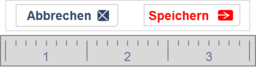
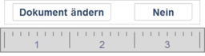
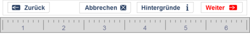
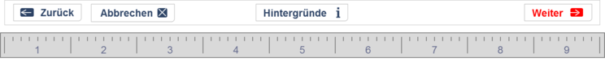

# CommandBarWidget
Das CommandBarWidget stellt eine Reihe von Buttons zur Verfügung, mit denen ein Anwender Aktionen in der Anwendung starten kann.
Das CommandBarWidget wird auf nahezu jeder Seite oder jedem Popup verwendet, um die primären Buttons für die Navigation oder die Interaktion mit einem Popup bereitzustellen.

Ergänzend zu den grafischen Buttons für die Mausbedienung bietet das CommandBarWidget die Definition von Tastaturkürzeln an, um insbesondere Standardfunktionen effizient per Tastatur steuern zu können [Hierzu zählt nicht die Taste „ESC“.
„ESC“ wird in Popups und Popovers verwendet, um das Popup/Popover zu schließen.
Hierzu werden beim PopupWidget und beim PopoverWidget jeweils geeignete Features angeboten.].

Grundsätzlich sollte das CommandBarWidget gemäß dem Style Guide von Windows eingesetzt werden, da das Verhalten von Windows den meisten Fachanwendern intuitiv bekannt ist und daher ohne weitere Erklärung verstanden wird.
Insbesondere sollten – insofern es nicht konkrete Gründe für ein anderes Verhalten gibt – die Regeln für die Sortierung und Benennung von Command Buttons angewendet werden (vgl.: [MS CommandButtons](http://msdn.microsoft.com/en-us/library/windows/desktop/dn742402.aspx)).


## Inhalt
* [Darstellung](#darstellung)
* [Beispiele](#beispiele)
* [Features](#features)
* [Validierungen](#validierungen)
* [Konfiguration](#konfiguration)
* [Integration](#integration)
   * [Schnittstellen](#schnittstellen)
      * [Ressourcen](#ressourcen)
      * [Actions](#actions)
      * [Flags](#flags)
   * [Verwendete Services](#verwendete-services)
   * [Beziehungen zu anderen Widgets](#beziehungen-zu-anderen-widgets)
* [Referenzen](#referenzen)
* [Anhänge](#anhänge)
   * [Technische Voraussetzungen](#technische-voraussetzungen)
   * [Fachlogik](#fachlogik)
   * [Testfälle](#testfälle)


## Darstellung
Das Aussehen des Widgets hängt stark von den Inhalten ab, die in die Buttons eingetragen werden.
Die folgenden Abbildungen zeigen einige beispielhafte Konfigurationen:



Abbildung 1:	Beispieldarstellung mit je einem (modifizierten) Standardbutton links und rechts auf 3 Spalten.



Abbildung 2:	Beispieldarstellung mit je einem (modifizierten) Standardbutton („Ja“ und „Nein“) links und rechts auf 3 Spalten.



Abbildung 3:	Beispieldarstellung mit insgesamt vier Buttons links und rechts auf 6 Spalten.



Abbildung 4:	Beispieldarstellung mit insgesamt vier Buttons links, in der Mitte und rechts auf 9 Spalten.


## Beispiele

```json
{
   "widget": "portal/command_bar_widget",
   "features": {
      "buttons": [
         {
            "action": "doSomething",
            "align": "LEFT",
            "i18nHtmlLabel": "Left 1"
         },
         {
            "action": "doNothing",
            "align": "CENTER",
            "i18nHtmlLabel": "Center 1"
         },
         {
            "action": "doNothing",
            "align": "RIGHT",
            "i18nHtmlLabel": "Right 1"
         },
         {
            "action": "doNothing",
            "align": "CENTER",
            "i18nHtmlLabel": "Center 2"
         },
         {
            "action": "doNothing",
            "align": "LEFT",
            "i18nHtmlLabel": "Left 2"
         }
      ]
   }
}
```


## Features

### Darstellung einer Buttonleiste (bar)
A1.1 Die Buttonleiste MUSS als Zeile mit drei Ankerpositionen gerendert werden: Links, Mitte und Rechts.

A1.2 Es MUSS möglich sein, eine konfigurierbare Liste von Buttons an den vorgenannten Ankerpositionen einzufügen.

A1.3 In einer Liste von Buttons MUSS jeweils ein Standardabstand (aus dem Theme) zwischen den Buttons dargestellt werden.

A1.4 Eine Liste von Buttons MUSS einheitlich dargestellt werden, egal an welcher Ankerposition die Liste eingefügt wird.

A1.5 Die Positionierung der Buttonliste an den jeweiligen Ankerpositionen MUSS sich an der entsprechenden Position orientieren: die Liste der linken Ankerposition wird am linken Rand des Widgets orientiert, die Liste der rechten Ankerposition am rechten Rand und die mittlere Liste wird zentriert.

A1.6 Wenn der zur Verfügung stehende Platz nicht ausreicht, SOLLEN die Buttonlisten jeweils getrennt untereinander dargestellt werden.
Hierbei DÜRFEN sie ihre jeweilige Orientierung (links, zentriert, rechts) beibehalten.

A1.7 Es MUSS möglich sein, einer Buttonliste eine absolute Breite in Gridspalten zuzuweisen, damit Sonderfälle bei der Aufteilung von Buttons auf die Listen besser behandelt werden können.

### Darstellung von konfigurierbaren Buttons (buttons)
A2.1 Ein Button MUSS per Konfiguration aktivierbar bzw. deaktivierbar sein.

A2.2 Der Buttontext bzw. -inhalt MUSS per Konfiguration einstellbar sein.
Der Text MUSS gemäß der in [aixigo ABP TS1] definierten Regeln für Content in HTML transformiert werden.
Die Verwendung von Icons MUSS hierbei möglich sein.

A2.3 Für jeden Button MUSS ein „Access Key“ definiert werden können, der eine Steuerung der Buttons per Tastatur erlaubt.

A2.4 Für jeden Button MUSS konfiguriert werden können, an welcher Position (Index) und in welcher Liste (Ankerposition) er eingefügt werden soll.

A2.5 Die Klasse des Buttons (Normal, Primär, Info, Erfolg, Warnung, Gefahr, Invers, Link) MUSS per Konfiguration einstellbar sein.

A2.6 Die Größe des Buttons (Mini, Klein, Standard, Groß) MUSS per Konfiguration einstellbar sein.

A2.7 Der dynamische Zustand eines Buttons MUSS in Abhängigkeit des aktuellen Seitenzustands veränderbar sein:
 Für unterschiedliche Seitenzustände (signalisiert durch Flags) muss der Button ausgegraut (disabled), ausgeblendet (hidden), entfernt (omitted) oder einfach normal sein können.
 Werden mehrere Flags für einen Zustand definiert, so MUSS der Zustand als aktiv gelten, sobald mindestens ein Flag zu true evaluiert.

A2.8 In Abhängigkeit des aktuellen Seitenzustands (signalisiert durch Flags, z.B. während der Ausführung einer Aktion [Die Ausführung einer Aktion beginnt mit dem Empfang des willTakeAction-Events und endet mit dem Empfang des didTakeAction-Events.]), SOLL auf einem Button, ein Spinner angezeigt werden können.
Hierzu SOLL eine CSS-Klasse des Themes (z.B. „is-busy“) gesetzt werden, die es erlaubt das Icon durch den Spinner zu ersetzen [Beispielhaft kann der HTML-Code hierfür so aussehen: Weiter `<i class=“hide-when-not-active icon-spinner“></i><i class=“hide-when-active icon-next“>`].

A2.9 Jedes Button-Element MUSS eine seitenweit eindeutige ID erhalten.
Diese ID MUSS bei dem entsprechenden takeActionRequest-Event unter dem Schlüssel anchorDomElement mitgesendet werden.

### Darstellung von Standardbuttons (previous, next, finish, ok, cancel, close, info, help, print, apply, yes, no)
A3.1 Es MUSS die folgenden Standardbuttons geben, die sich wie frei konfigurierbare Buttons verhalten, aber durch Default-Werte sinnvoll vorkonfiguriert sind:

* Zurück (previous)
* Weiter (next)
* Fertigstellen (finish)
* OK (ok)
* Abbruch (cancel)
* Schließen (close)
* Info (info)
* Hilfe (help)
* Drucken (print)
* Anwenden (apply)
* Ja (yes)
* Nein (no)

### Ausrichtung (layout)
A4.1 Standardmäßig werden die Buttons horizontal gerendert.
Es MUSS aber auch möglich sein, die Buttons vertikal darzustellen.
Dazu MUSS das Widget das Feature „layout“ mit der Eigenschaft „variant“ unterstützen, welche die Werte „HORIZONTAL“ (Standard) und „VERTICAL“ akzeptiert.

### Unterstützung von Internationalisierung (i18n)
A5.1 Das Widget MUSS die Konfiguration einer Locale-ID gemäß [aixigo AONE TS1.08] erlauben. Bei der Darstellung internationalisierter Inhalte MUSS stets das aktuelle, per Event empfangene Language-Tag zu dieser Locale-ID genutzt werden.

## Validierungen
Keine.

## Konfiguration

Siehe auch [widget.json](widget.json)

### buttons
Das buttons-Feature enthält ein Array mit einzelnen JSON-Objekten.
Jedes einzelne JSON-Objekt definiert einen konkreten, konfigurierbaren Button mit der in der folgenden Tabelle dokumentierten Struktur.

* enabled
   * Typ: Boolean
   * Standardwert: true
   * Beschreibung: Aktivierung des Features und damit der Bereitstellung eines Buttons.
   Ist der Wert nicht true, dann wird der Button vollständig ignoriert.
* align
   * Typ: String, LEFT|CENTER|RIGHT
   * Standardwert: „LEFT“
   * Beschreibung: Ankerpunkt, an dem der Button eingefügt werden soll.
* index
   * Typ: Integer
   * Standardwert: 0
   * Beschreibung: Index für die Sortierung der Buttonliste innerhalb eines Ankerpunkts.
   Kleinere Indexwerte stehen weiter links.
   Bei gleichem Index gilt die Reihenfolge der Definition.
   Standardbuttons gelten als zuerst definiert.
* i18nHtmlLabel
   * Typ: Map<String, String> | String
   * Standardwert: „Button“
   * Beschreibung: Button-Beschriftung. String-kodiertes HTML, bei i18n-Nutzung nach [aixigo AONE TS1.08] aufgeschlüsselt nach Language-Tag.
* action
   * Typ: String
   * Standardwert: null
   * Beschreibung: ID der Aktion, die bei Betätigung des Buttons ausgelöst werden soll.
* accessKey
   * Typ: String
   * Standardwert: null
   * Beschreibung: Buchstabe für die Betätigung des Buttons durch eine Tastenkombination
    [Verwendung des HTML-Attributs „accesskey“.
    Je nach Browser und Betriebssystem werden abweichende Steuertasten für die Aktivierung verwendet.
    Wird beispielsweise „A“ konfiguriert, so wird unter Mac OS einheitlich die Tastenkombination Steuerung+ Alt + A erwartet, unter Windows und Linux Alt + A (Internet Explorer, Google Chrome, Safari) bzw. Alt + Shift + A (Firefox).
    Die zu verwendenden Steuertasten kann man ggf. im Webbrowser abweichend konfigurieren. Vgl. auch [MDN GlobalAttributes]. ].
* class
   * Typ: String, NORMAL|PRIMARY|INFO|SUCCESS|WARNING|DANGER|INVERSE|LINK
   * Standardwert: „NORMAL“
   * Beschreibung: Darstellungsklasse gemäß Theme.
* size
   * Typ: String, MINI|SMALL|DEFAULT|LARGE
   * Standardwert: „DEFAULT“
   * Beschreibung: Größe gemäß Theme.
* hideOn
   * Typ: Array< String >
   * Standardwert: null
   * Beschreibung: Liste von Flags, bei deren Präsenz  (Wert mindestens eines Flags ist true) der Button unsichtbar werden soll.
   Ein unsichtbarer Button belegt weiterhin Platz, wird aber nicht dargestellt und ist auch nicht über die Tastatur auslösbar.
   Steht vor dem Namen des Flags ein „!“, so wird der Wert des Flags negiert.
* disableOn
   * Typ: Array< String >
   * Standardwert: null
   * Beschreibung: Liste von Flags, bei deren Präsenz (Wert mindestens eines Flags ist true) der Button ausgegraut werden soll.
   Ein ausgegrauter Button kann nicht angewählt/ausgelöst werden.
   Steht vor dem Namen des Flags ein „!“, so wird der Wert des Flags negiert.
* omitOn
   * Typ: Array< String >
   * Standardwert: null
   * Beschreibung: Liste von Flags, bei deren Präsenz (Wert mindestens eines Flags ist true) der Button ausgelassen werden soll.
   Ein ausgelassener Button belegt keinen Platz, wird nicht dargestellt und ist auch nicht über die Tastatur auslösbar.
   Steht vor dem Namen des Flags ein „!“, so wird der Wert des Flags negiert.
* busyOn
   * Typ: Array< String >
   * Standardwert: null
   * Beschreibung: Liste von Flags, bei deren Präsenz (Wert mindestens eines Flags ist true) der Button als „beschäftigt“ gekennzeichnet werden soll.
   In der Regel erfolgt diese Darstellung über einen Spinner, der anstelle des Icons gerendert wird.
   Steht vor dem Namen des Flags ein „!“, so wird der Wert des Flags negiert.


### Standardbuttons (previous, next, finish, ok, cancel, close, info, help, print, apply, yes, no)
Die Standardbuttons verhalten sich jeweils genau wie ein frei konfigurierbarer Button.
Der Unterschied besteht darin, dass sie bereits vorkonfiguriert sind.
Alle Standardbuttons sind zunächst deaktiviert (enabled = false) und müssen manuell aktiviert werden.
Eine darüber hinausgehende Konfiguration ist optional möglich aber nicht notwendig.

Die folgende Tabelle dokumentiert die konkreten Standardwerte für die Standardbuttons:
* Name (Feature): Zurück (previous)
   * Anker (Index): links (-100)
   * Label (de_DE/en_US): <i class=“ax-icon-previous“></i> Zurück/Back
   * Aktion: previous
   * Beschreibung: Navigation zum vorherigen Prozessschritt.
* Name (Feature): Weiter (next)
   * Anker (Index): rechts (100)
   * Label (de_DE/en_US): Weiter/Next <i class=“ax-icon-next“></i>
   * Aktion: next
   * Beschreibung: Navigation zum nächsten Prozessschritt.
* Name (Feature): OK (ok)
   * Anker (Index): rechts (94)
   * Label (de_DE/en_US): <i class=“ax-icon-ok“></i> OK/OK
   * Aktion: ok
   * Beschreibung: Aktuelles Popup schließen und Daten übernehmen.
* Name (Feature): Anwenden (apply)
   * Anker (Index): rechts (95)
   * Label (de_DE/en_US): <i class=“ax-icon-apply“></i> Anwenden/Apply
   * Aktion: apply
   * Beschreibung: Daten aus dem aktuellen Popup übernehmen, aber Popup nicht schließen.
* Name (Feature): Cancel (cancel)
   * Anker (Index): rechts (96)
   * Label (de_DE/en_US): <i class=“ax-icon-cancel“></i> Abbruch/Cancel
   * Aktion: cancel
   * Beschreibung: Aktuelles Popup schließen und Änderungen verwerfen.
* Name (Feature): Ja (yes)
   * Anker (Index): rechts (97)
   * Label (de_DE/en_US): <i class=“ax-icon-yes“></i> Ja/Yes
   * Aktion: yes
   * Beschreibung: Frage aus Popup mit „Ja“ beantworten
   [In der Regel sollte der Text dieses Buttons überschrieben werden mit einer sprachlichen Konkretisierung, z.B. „Beratung beenden“, damit die Antwort verständlich wird, ohne die Frage zu lesen.
   Gerade erfahrene Anwender neigen dazu, Fragetexte vollständig zu überlesen.].
* Name (Feature): Nein (no)
   * Anker (Index): rechts (98)
   * Label (de_DE/en_US): <i class=“ax-icon-no“></i> Nein/No
   * Aktion: no
   * Beschreibung: Frage aus Popup mit „Nein“ beantworten.
* Name (Feature): Fertigstellen (finish)
   * Anker (Index): rechts (99)
   * Label (de_DE/en_US): <i class=“ax-icon-finish“></i> Fertigstellen/Finish
   * Aktion: finish
   * Beschreibung: Aktuellen Prozess beenden und zum Abschluss bringen.
* Name (Feature): Info (info)
   * Anker (Index): Mitte (-50)
   * Label (de_DE/en_US): <i class=“ax-icon-info“></i> Info/Info
   * Aktion: info
   * Beschreibung: Informationen zum aktuellen Vorgang aufrufen.
* Name (Feature): Hilfe (help)
   * Anker (Index): Mitte (-49)
   * Label (de_DE/en_US): <i class=“ax-icon-help“></i> Hilfe/Help
   * Aktion: help
   * Beschreibung: Hilfe zum aktu-ellen Vorgang aufrufen.
* Name (Feature): Drucken (print)
   * Anker (Index): Mitte (-48)
   * Label (de_DE/en_US): <i class=“ax-icon-print“></i> Drucken/Print
   * Aktion: print
   * Beschreibung: Aktuellen Vor-gang drucken.


### areas
Konfiguriert die Bereiche zur Aufnahme von Buttons (left, center und right).
Hier kann die Breite des jeweiligen Bereichs angepasst werden, um eine besondere Verteilung der Buttons auf den zur Verfügung stehenden Platz zu ermöglichen.
Wenn beispielsweise der linke Bereich nur einen Button beinhaltet, so kann dessen Breite auf zwei Gridspalten beschränkt und der Rest zwischen dem center- und right-Bereich aufteilt werden.

Folgende Konfigurationsmöglichkeiten können jeweils für einen der Bereiche left, center und right angewendet werden:
* columnWidth
   * Typ: Integer
   * Standardwert: null
   * Beschreibung: Absolute Anzahl an Gridspalten, die der jeweilige Bereich zur Darstellung verwenden soll.

### layout
* variant
   * Typ: String, mögliche Werte: „HORIZONTAL“, „VERTICAL“
   * Standardwert: "HORIZONTAL"
   * Beschreibung: Bestimmt, ob die Buttons horizontal oder vertikal dargestellt werden sollen.

### i18n
* locale
   * Typ: String, gültiger Topic-Bezeichner
   * Standardwert: „default“
   * Beschreibung: Locale-ID.
   Das aktuell gültige Language-Tag zu dieser Locale wird bei der Darstellung internationalisierter Werte verwendet.


## Integration
Das folgende Kapitel stellt relevante Informationen für die Verwendung des Widgets innerhalb einer Anwendung bereit.
Diese Informationen ergeben sich vollständig aus den bereits benannten funktionalen Anforderungen.
Dieses Kapitel enthält also keine neuen Vorgaben für die Implementierung.
Es ist ausschließlich dazu gedacht, den praktischen Umgang mit des Widgets zu erleichtern.


### Schnittstellen

#### Ressourcen
Keine.

#### Actions
* Action: \.*.action
   * Zugriff: Emittiert
   * Erläuterung: Reaktion auf die Betätigung eines Buttons bzw. die Betätigung eines „Access Keys“.

#### Flags
* Flag: \*.omitOn|hideOn|disableOn|busyOn
   * Zugriff: Konsumiert
   * Erläuterung: Veränderung in einem Seiten-Flag.
   In Abhängigkeit der Flags können Buttons ein- oder ausgeblendet werden etc.

### Verwendete Services
Keine.


### Beziehungen zu anderen Widgets
Das CommandBarWidget ist das primäre Widget, welches Aktionen für eine Seite oder ein Popup auslöst.
Es löst aber nur ein takeActionRequest-Event aus und kümmert sich nicht selbst um die Bearbeitung der Aktion.
Insbesondere ist es nicht für Validierung, Speicherung von Daten oder die Navigation zuständig.
In vielen Fällen kümmert sich die TaskActivity um die Behandlung des vom CommandBarWidget emittierten takeActionRequest-Events.


## Referenzen
Die folgenden Quellen sind für das Verständnis des vorliegenden Dokuments hilfreich oder notwendig.

* aixigo AONE TS1.01: Basiskonzepte des AS3-Frontends, aixigo AG, Aachen, Deutschland.
* aixigo AONE TS1.02: Events, aixigo AG, Aachen, Deutschland.
* aixigo AONE TS1.03: Namenskonventionen, aixigo AG, Aachen, Deutschland.
* aixigo AONE TS1.08: Internationalisierung, aixigo AG, Aachen, Deutschland.
* [MS CommandButtons](http://msdn.microsoft.com/en-us/library/windows/desktop/dn742402.aspx) MS Windows Guidelines: Command Buttons, Microsoft,  USA, http://msdn.microsoft.com/en-us/library/windows/desktop/dn742402.aspx.
* [MDN GlobalAttributes](https://developer.mozilla.org/en-US/docs/HTML/Global_attributes) Mozilla Developer Network: Global Attributes, Mozilla,https://developer.mozilla.org/en-US/docs/HTML/Global_attributes


## Anhänge

### Technische Voraussetzungen

* Name: [LaxarJS](http://laxarjs.org)
   * Version: 0.9

### Fachlogik
Keine.

### Testfälle
Keine.
